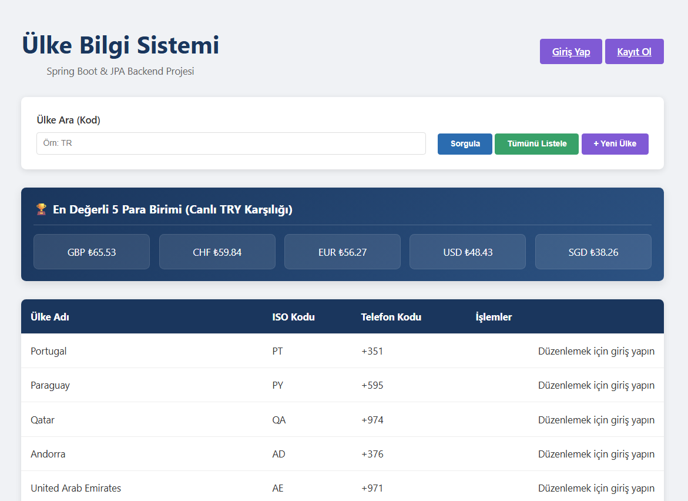
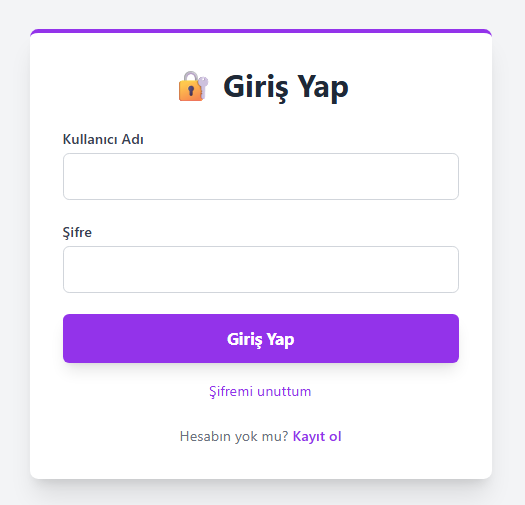
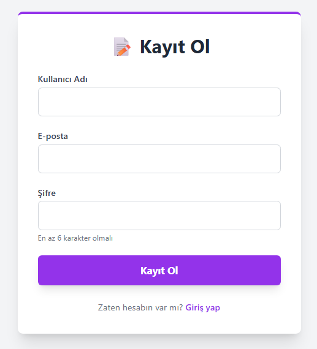
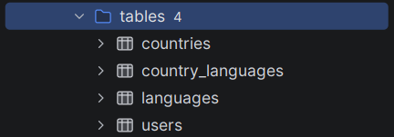
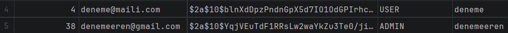

# 🌍 Ülke Bilgi Sistemi (Spring Boot & JPA)

Ülke verilerinin, dillerin ve anlık canlı döviz kurlarının takip edildiği; rol bazlı yetkilendirme (RBAC) ve güvenli kimlik doğrulama altyapısına sahip RESTful backend ve yönetim sistemi.

---

### 📖 Docker & Veritabanı Mimarisi

> **Not:** Projenin Docker Compose orkestrasyonu, PostgreSQL container ayağa kaldırma adımları ve IDE veritabanı bağlantısı rehberi için yukarıdaki Medium yazımı inceleyebilirsiniz.

---

### 🖥️ Uygulama Arayüzü & Özellikler

#### Ana Dashboard & Canlı Kurlar
Ülke arama (ISO kodu), listeleme ve canlı döviz kurları paneli:

#### Kimlik Doğrulama (Auth Modülü)
Kullanıcı giriş ve kayıt formları:

| Giriş Yap | Kayıt Ol |
| :---: | :---: |
|  |  |

---

### 🗄️ Veritabanı Yapısı & Güvenlik

#### İlişkisel Tablo Yapısı
Sistemde ülke, dil ve yetkilendirme yönetimini sağlayan tablolar (`Many-to-Many` ilişki için `country_languages` junction tablosu):

#### Şifreleme & Rol Bazlı Yetkilendirme (BCrypt & RBAC)
Kullanıcı parolaları veritabanında **BCrypt** algoritmasıyla hash'lenerek saklanır; yetkilendirme `USER` ve `ADMIN` rolleri üzerinden yürütülür:

---

### 🛠️ Teknolojiler

* **Backend:** Java, Spring Boot, Spring Data JPA, Spring Security
* **Veritabanı:** PostgreSQL
* **Konteynerizasyon:** Docker, Docker Compose
* **Güvenlik:** BCrypt Password Hashing, Rol Bazlı Erişim Kontrolü (RBAC)
